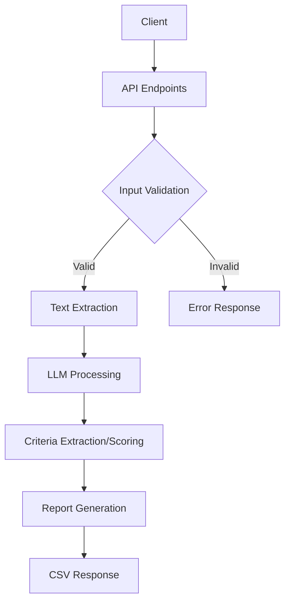

# Smart Resume Ranking System 🔍📄

A production-grade API system for automated resume ranking against job descriptions using FastAPI and OpenAI GPT.

[](https://fastapi.tiangolo.com/)
[](https://openai.com/)

## Features ✨

- **JD Criteria Extraction** - Automatically extract key requirements from job descriptions
- **Resume Scoring** - Score multiple resumes against criteria on 0-5 scale
- **AI-Powered Analysis** - Leverages GPT-3.5 for semantic understanding
- **Enterprise Ready** - Input validation, error handling, and rate limiting
- **CSV Reports** - Generate detailed score reports in CSV format
- **Swagger Documentation** - Interactive API documentation included

## Table of Contents 📚

- [Installation](#installation-)
- [Usage](#usage-)
- [API Endpoints](#api-endpoints-)
- [Architecture](#architecture-)
- [Error Handling](#error-handling-)
- [Contributing](#contributing-)

## Installation 🛠️

### Prerequisites
- Python 3.9+
- OpenAI API key
- Poetry (recommended) or pip

### Setup

1. Clone repository:
```bash
git clone https://github.com/yourusername/resume-ranking-system.git
cd resume-ranking-system
```

2. Install dependencies:
```bash
pip install -r requirements.txt
```

3. Configure environment:
```bash
export OPENAI_API_KEY="your-openai-api-key"
```

## Usage 🚀

### Running the Server
```bash
uvicorn main:app --reload
```

Access interactive docs at: http://localhost:8000/docs

### Example Requests

1. Extract criteria from JD:
```bash
curl -X POST "http://localhost:8000/extract-criteria" \
  -H "Content-Type: multipart/form-data" \
  -F "file=@job_description.pdf"
```

2. Score resumes:
```bash
curl -X POST "http://localhost:8000/score-resumes" \
  -H "Content-Type: multipart/form-data" \
  -F "criteria=5+ years Python experience" \
  -F "criteria=AWS Certification" \
  -F "files=@resume1.pdf" \
  -F "files=@resume2.docx" \
  -o scores.csv
```

## API Endpoints 📡

### 1. Extract Criteria (`POST /extract-criteria`)
**Input**: PDF/DOCX job description  
**Output**: JSON list of criteria  
```json
{
  "criteria": [
    "5+ years Python experience",
    "AWS Certified Solutions Architect",
    "Machine Learning expertise"
  ]
}
```

### 2. Score Resumes (`POST /score-resumes`)
**Input**: 
- List of criteria
- Multiple resume files (PDF/DOCX)

**Output**: CSV file with scores  
```
Candidate Name,Python Experience,AWS Certification,Total Score
John Doe,5,4,9
Jane Smith,4,5,9
```

## Architecture 🏗️



### Key Components:
1. **Input Validation Layer**  
   - File type verification
   - Size restrictions (max 20 files)
   - Criteria limits (max 15 criteria)

2. **Text Extraction Engine**  
   - PDF text extraction using PyPDF2
   - DOCX parsing with python-docx
   - Error handling for corrupted files

3. **AI Processing Core**  
   - GPT-3.5-turbo for criteria extraction
   - Semantic scoring with temperature control
   - JSON response validation

4. **Reporting System**  
   - Pandas DataFrame management
   - CSV sanitization and streaming
   - Memory-efficient ByteIO handling

## Error Handling ⚠️

| Code | Error Type | Description |
|------|------------|-------------|
| 400 | Bad Request | Invalid file type/missing parameters |
| 500 | Internal Error | LLM processing failure |
| 503 | Service Unavailable | OpenAI API timeout |

**Rate Limits**:
- Max 3 retries for OpenAI API
- 15s timeout per LLM request

